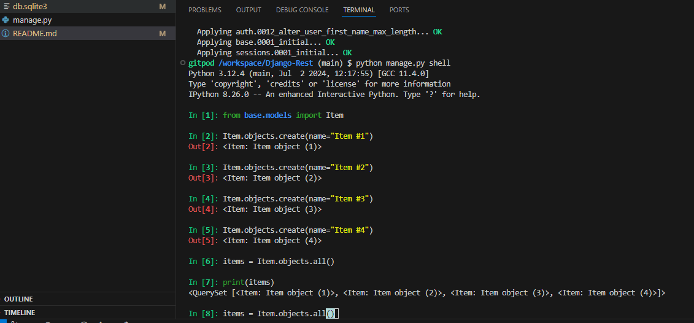
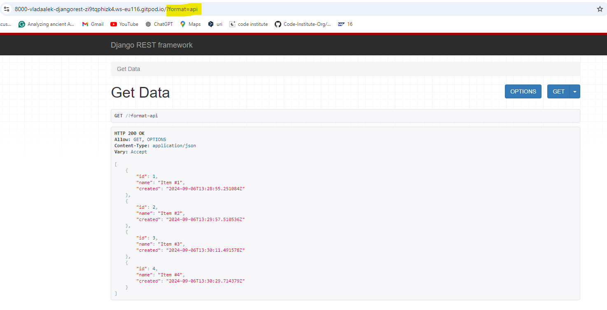
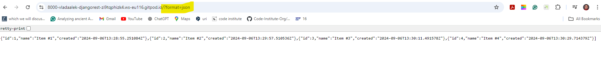
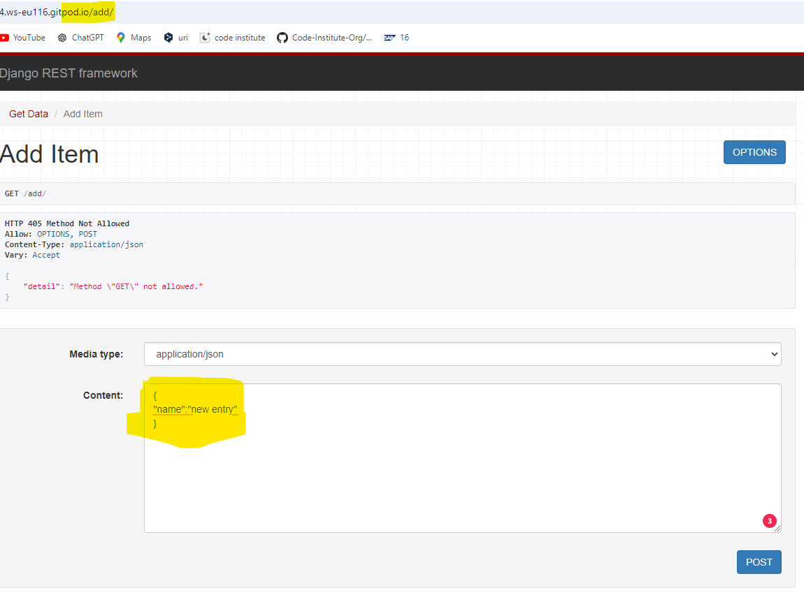
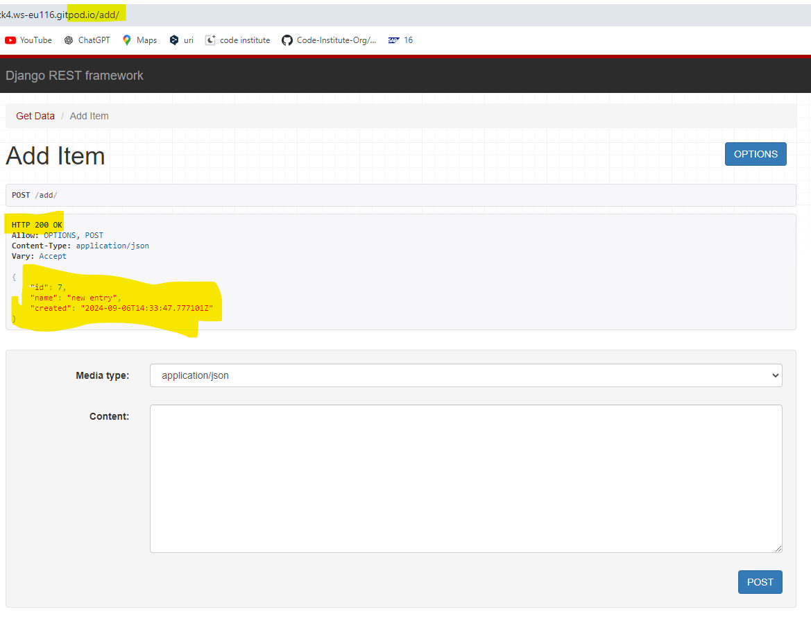
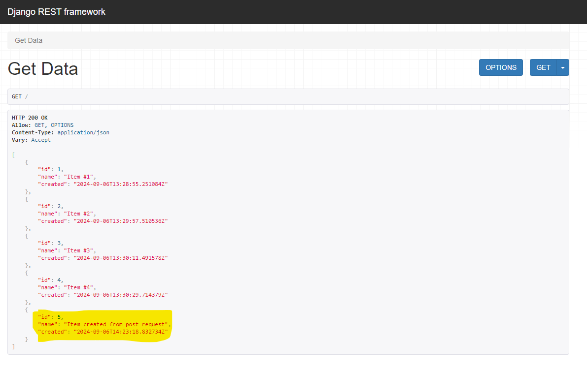

# Django-Rest

### Purpose: 
displaying data in public API or within the project

### requirements:
 - Django 

### instalation
 - pip instal django
 - pip install djangorestframework

### project

#### create individual apps

 - django-admin startproject myproject
 - python manage.py startapp base

#### migrating model
- python manage.py makemigrations
- python manage.py migrate

#### create/populate db
- python manage.py shell
- from base.models import Item
- Item.objects.create(name="Item #1")
- check DB content 1) iterate items = Item.objects.all() 2) print(items)
exit()

#### Results

#### Add Data with API

- addItem view in API app

